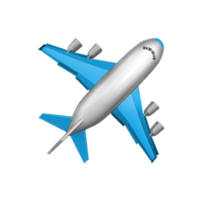
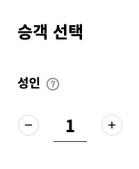

<p align="middle" >
  
</p>
<h2 align="middle">누구나 접근할 수 있는 항공사 웹사이트</h2>
<p align="middle">항공사 웹사이트 컴포넌트의 스크린 리더 접근성 높이기</p>
<p align="middle">
  
  
  
  
  
</p>

<br/>

## 🎯 요구사항1 - Spin Button: 승객수 입력하기



- [x] 최대 인원수는 3명까지만 가능하게 구현한다.
- [x] 실제 스크린 리더는 아래와 같이 읽을 수 있어야 한다.

```
성인 탑승자 한명 줄이기 버튼
성인 1 텍스트 숫자만 수정
성인 탑승자 한명 늘리기 버튼
성인 승객 추가 2
성인 탑승자 한명 늘리기 버튼
성인 승객 추가 3
```

<br/>

## 🎯 요구사항2 - Carousel: 지금 떠나기 좋은 여행


- [ ] 목록은 8개를 구현한다.
- [ ] 실제 스크린 리더는 아래와 같이 읽을 수 있어야 한다.

```
1. 지금 떠나기 좋은 여행
2. 목록 8개 항목 포함 서울/인천 로스앤젤레스 일반석 왕복 1,481,800 대한민국 원 링크 목록 항목
3. 다음 버튼 (사용 중지)
4. 이전 버튼 (사용 중지)
```

<br/>

## 🎯 요구사항3 - 메인 네비게이션


- [ ] 실제 스크린 리더는 아래와 같이 읽을 수 있어야 한다.

```
탭
목록 항목 예매 버튼 접힘
목록 항목 공항 버튼 접힘
목록 항목 기내 버튼 접힘
목록 항목 스카이패스 버튼 접힘

(엔터키 누르기)

스카이패스 버튼 펼쳐짐
목록 5개 항목 포함 우수회원 혜택 링크 목록 항목
```

## 📝 코드리뷰시 체크 리스트

- [ ] 불필요한 마크업은 없는가?
- [ ] 웹표준에 어긋나는 마크업은 없는가?
- [ ] 스크린리더가 예시와 같도록 읽는가?

<br/>

## 👏🏼 Contributing

만약 미션 수행 중에 개선사항이 보인다면, 언제든 자유롭게 PR을 보내주세요.

<br/>

## 🐞 Bug Report

버그를 발견한다면, [Issues](https://github.com/woowacourse/a11y-airline/issues)에 등록해주세요.

<br/>

## 📝 License

This project is [MIT](https://github.com/woowacourse/a11y-airline/blob/main/LICENSE) licensed.
